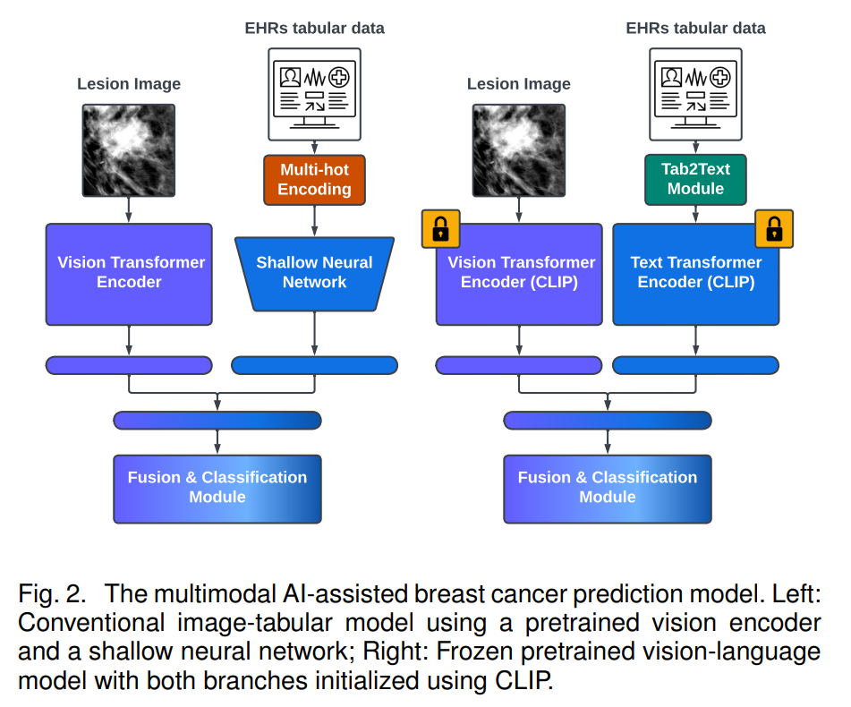
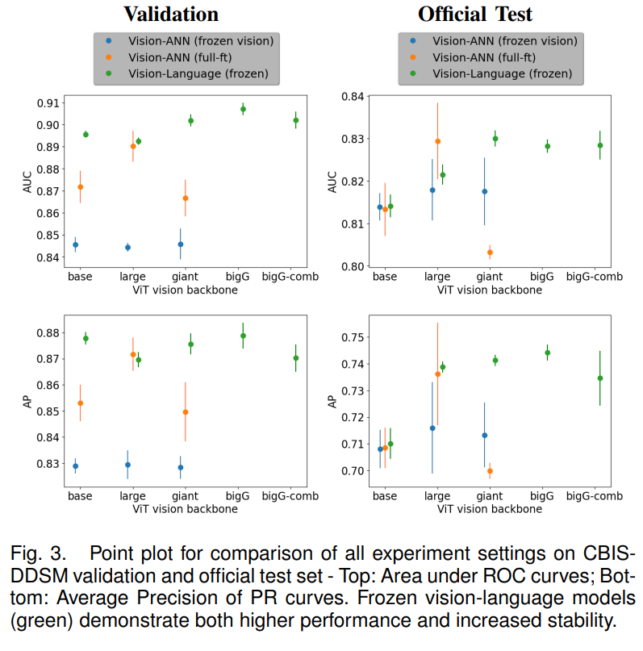
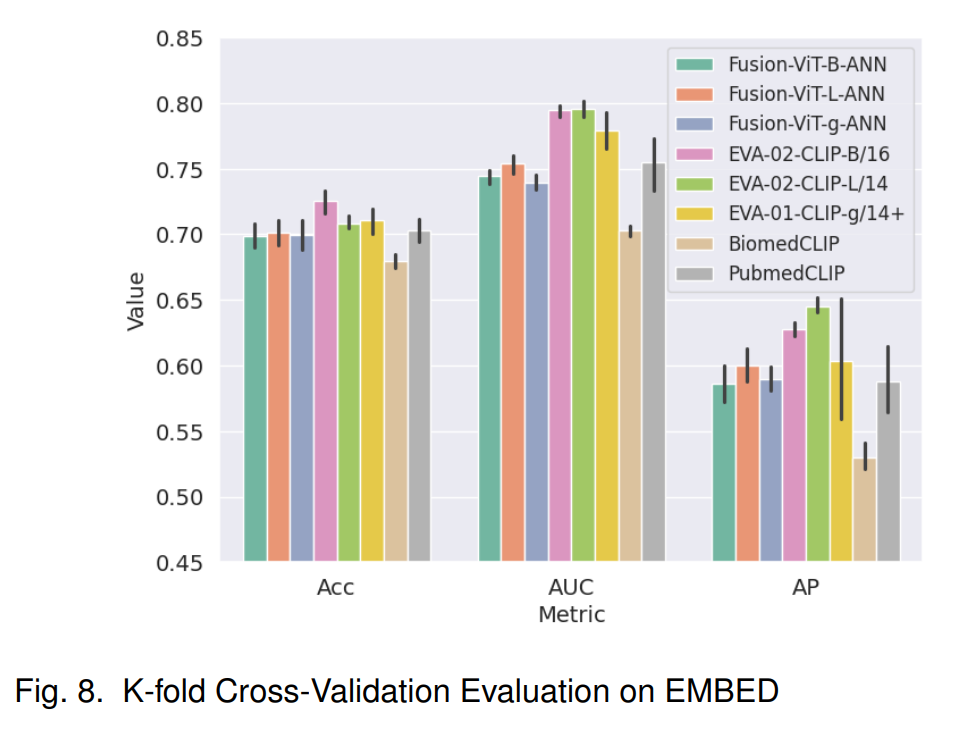

## Frozen Large-scale Pretrained Vision-Language Models are the Effective Foundational Backbone for Multimodal Breast Cancer Prediction [[JBHI Paper](https://ieeexplore.ieee.org/abstract/document/10769012)]

[](https://www.python.org/downloads/release/python-379/)
[](https://developer.nvidia.com/cuda-10.1-download-archive-base)
[](https://pytorch.org/get-started/previous-versions/)
[](https://www.tensorflow.org/install)
[](https://www.tensorflow.org/install)

#### Vo, Hung Q., Lin Wang, Kelvin K. Wong, Chika F. Ezeana, Xiaohui Yu, Wei Yang, Jenny Chang, Hien V. Nguyen, and Stephen TC Wong. "Frozen Large-scale Pretrained Vision-Language Models are the Effective Foundational Backbone for Multimodal Breast Cancer Prediction." 

Published in IEEE Journal of Biomedical and Health Informatics (2024)

## Abstract
Breast cancer is a pervasive global health
concern among women. Leveraging multimodal data from
enterprise patient databases—including Picture Archiving
and Communication Systems (PACS) and Electronic Health
Records (EHRs)—holds promise for improving prediction.
This study introduces a multimodal deep-learning model
leveraging mammogram datasets to evaluate breast cancer prediction. Our approach integrates frozen large-scale
pretrained vision-language models, showcasing superior
performance and stability compared to traditional imagetabular models across two public breast cancer datasets.
The model consistently outperforms conventional full finetuning methods by using frozen pretrained vision-language
models alongside a lightweight trainable classifier. The
observed improvements are significant. In the CBIS-DDSM
dataset, the Area Under the Curve (AUC) increases from
0.867 to 0.902 during validation and from 0.803 to 0.830
for the official test set. Within the EMBED dataset, AUC
improves from 0.780 to 0.805 during validation. In scenarios with limited data, using Breast Imaging-Reporting
and Data System category three (BI-RADS 3) cases, AUC
improves from 0.91 to 0.96 on the official CBIS-DDSM test
set and from 0.79 to 0.83 on a challenging validation set.
This study underscores the benefits of vision-language
models in jointly training diverse image-clinical datasets
from multiple healthcare institutions, effectively addressing
challenges related to non-aligned tabular features. Combining training data enhances breast cancer prediction on
the EMBED dataset, outperforming all other experiments. In
summary, our research emphasizes the efficacy of frozen
large-scale pretrained vision-language models in multimodal breast cancer prediction, offering superior performance and stability over conventional methods, reinforcing their potential for breast cancer prediction.

## Installation
### Required Packages
```
python==3.8.18
pytorch==1.13.1
timm==0.9.1
transformers==4.44.0
huggingface-hub==0.24.5
open-clip-torch==2.23.0
tokenizers==0.19.1
```
### Install using Conda
```sh
conda env create -f virtual_env.yaml
```

## Dataset Preparation
* Unzip processed_breast_cancer_data.zip
* Modify `dataset_init.py` located at `src/datasets/dataset_init.py`. This file `dataset_init.py` file has implementations of multiple breast cancer dataset classes. To run this code, the data_root parameter will need to be modified for all CBIS-DDSM classes to point to the correct path of `CBIS-DDSM/original` in the previously unzipped folder.

## Usage
### For Training
```sh
cd src/train

python -m torch.distributed.launch --nproc_per_node=4 --master_port=6006 \
    train.py --config-path <PATH TO YAML TRAINING CONFIG>
```
### For Testing
```sh
cd src/test

python -m torch.distributed.launch --nproc_per_node=4 --master_port=6006 \
    test.py --config-path <PATH TO YAML TESTING CONFIG>
```

### Available Scripts
```sh
# Train & Test for all BI-RADS cases on CBIS-DDSM dataset
. src/scripts/train_ddsm_script.sh
. src/scripts/test_ddsm_script.sh

# Train & Test for only BI-RADS 3 case on CBIS-DDSM dataset
. src/scripts/train_ddsm_birads3_script.sh
. src/scripts/test_ddsm_birads3_script.sh
```

## Models



## Results



## Citing
### BibTeX
```bibtex
@ARTICLE{10769012,
  author={Vo, Hung Q. and Wang, Lin and Wong, Kelvin K. and Ezeana, Chika F. and Yu, Xiaohui and Yang, Wei and Chang, Jenny and Nguyen, Hien V. and Wong, Stephen T.C.},
  journal={IEEE Journal of Biomedical and Health Informatics}, 
  title={Frozen Large-scale Pretrained Vision-Language Models are the Effective Foundational Backbone for Multimodal Breast Cancer Prediction}, 
  year={2024},
  volume={},
  number={},
  pages={1-14},
  keywords={Breast cancer;Predictive models;Data models;Visualization;Training;Breast;Biological system modeling;Mammography;Decoding;Adaptation models;Multimodal Learning;Vision-Language Learning;Breast Cancer;Foundation Models;Large Vision Models;Large Language Models;Mammograms;Electronic Health Records (EHRs);Tabular Data;BI-RADS 3},
  doi={10.1109/JBHI.2024.3507638}}

```

## License
MIT License

Copyright (c) 2024 HULA-AI

## Acknowledgement
* [pytorch-image-models](https://github.com/huggingface/pytorch-image-models)
* [EVA-CLIP](https://github.com/baaivision/EVA)
* [Open-CLIP](https://github.com/mlfoundations/open_clip/)
## References
**Fang, Yuxin, et al.** "Eva: Exploring the limits of masked visual representation learning at scale." Proceedings of the IEEE/CVF Conference on Computer Vision and Pattern Recognition. 2023.

**Cherti, Mehdi, et al.** *"Reproducible scaling laws for contrastive language-image learning."* Proceedings of the IEEE/CVF Conference on Computer Vision and Pattern Recognition. 2023.

**Radford, Alec, et al.** *"Learning transferable visual models from natural language supervision." International conference on machine learning.* PMLR, 2021.

**Lee, Rebecca Sawyer, et al.** *"A curated mammography data set for use in computer-aided detection and diagnosis research."* Scientific data 4.1 (2017): 1-9.

**Jeong, Jiwoong J., et al.** *"The EMory BrEast imaging Dataset (EMBED): A racially diverse, granular dataset of 3.4 million screening and diagnostic mammographic images."* Radiology: Artificial Intelligence 5.1 (2023): e220047.
